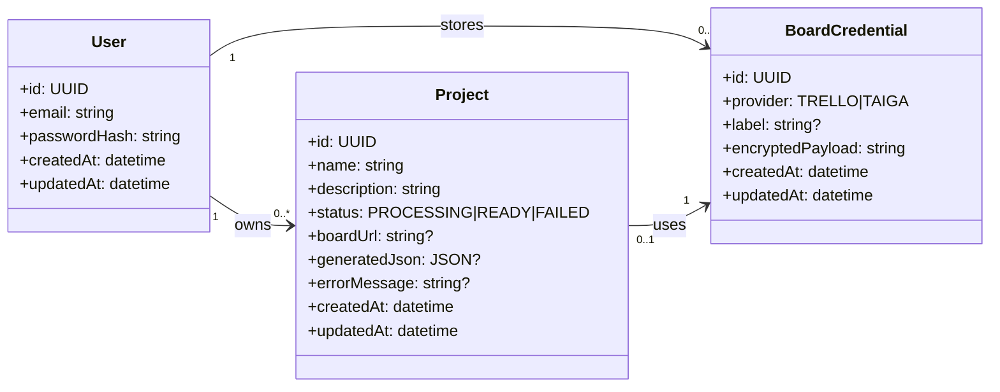
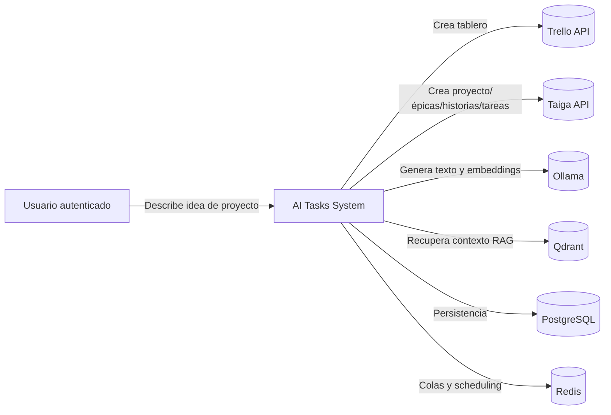
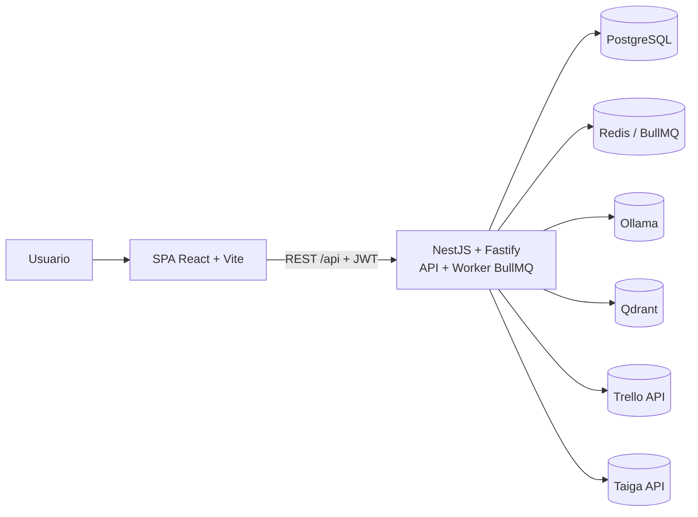
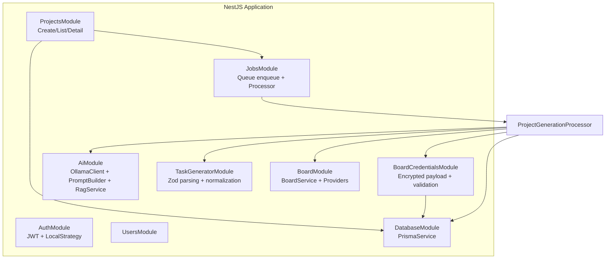
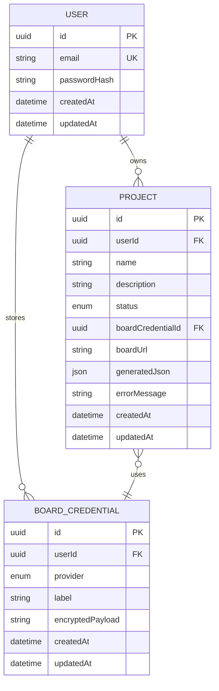
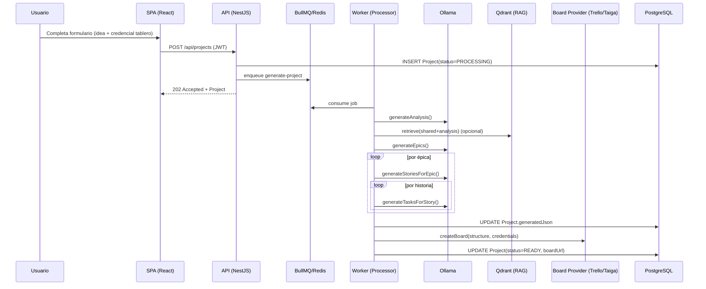
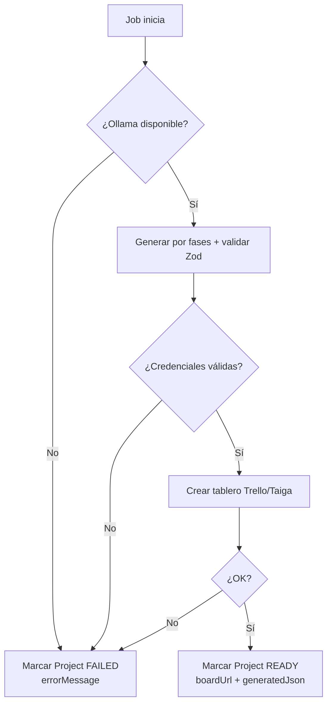

## AI Project Tasks API — Documentación de Arquitectura

Backend (con SPA embebida) que **convierte una idea de proyecto** (nombre + descripción) en un **backlog ejecutable** (épicas → historias → tareas) y lo **materializa automáticamente** en un tablero **Trello** o **Taiga**, usando **IA local (Ollama)** y **RAG opcional (Qdrant)**.

---

## 1. Descripción del proyecto

### Qué problema resuelve
- **Dolor real**: pasar de “tengo una idea” a un plan de ejecución concreto suele requerir experiencia, tiempo y consistencia en el desglose.
- **Solución**: automatiza la **planificación incremental** (análisis → épicas → historias → tareas), valida la salida (JSON + Zod) y genera un **artefacto operativo** (tablero) listo para empezar a trabajar.

### Tipo de sistema
- **Sistema backend-first** con **procesamiento asíncrono** (cola/worker) y **API REST** (NestJS + Fastify).
- **SPA (React + Vite)** servida desde el mismo contenedor para simplificar despliegue y demo.
- Integraciones externas: **Trello API** y **Taiga API**.

### Público objetivo
- **Product-minded engineers**, tech leads o founders que necesitan un **arranque rápido** y estructurado.
- Equipos que usan tableros (Trello/Taiga) y quieren convertir requisitos difusos en trabajo granular.

### Contexto de uso
- La creación de proyectos es **asíncrona**: el usuario crea un proyecto y consulta su estado (PROCESSING → READY/FAILED).
- El sistema puede mejorar resultados inyectando **guías/plantillas** desde RAG, pero **degrada con elegancia** si Qdrant/RAG no está disponible.

---

## 2. Requisitos

### Requisitos funcionales
- **Autenticación**: registro y login con **JWT**.
- **Gestión de integraciones**:
  - Crear/listar/actualizar/eliminar **credenciales** de Trello o Taiga por usuario.
  - Verificación básica de conectividad (Trello members/me, Taiga auth) al registrar credenciales.
- **Proyectos**:
  - Crear un proyecto (nombre, descripción, credencial de tablero) y **encolar** la generación.
  - Listar proyectos del usuario y consultar el detalle/estado.
  - Persistir resultado generado en generatedJson y URL del tablero en boardUrl.
- **Generación IA** (pipeline):
  - Paso 1: análisis del proyecto (tipo, actores, funcionalidades core).
  - Paso 2: generación de épicas de alto nivel.
  - Paso 3: historias por épica.
  - Paso 4: tareas técnicas por historia.
  - Validación/normalización del JSON generado con **Zod**.
- **RAG opcional**:
  - Ingesta de contenido Markdown (rag-content/) → embeddings (Ollama) → Qdrant.
  - Recuperación de fragmentos por fase (analysis, epics, stories, tasks, project_structure, shared).
- **Creación de tableros**:
  - Trello: listas por épica + tarjetas por historia + checklist de tareas.
  - Taiga: proyecto + épicas + user stories + tasks.

### Requisitos no funcionales

#### Escalabilidad
- **Asíncrono por defecto**: BullMQ desacopla la experiencia HTTP del trabajo pesado (LLM + APIs externas).
- **Escalado horizontal** (evolución natural):
  - Separar **API** y **worker** en contenedores distintos (misma base de código).
  - Incrementar concurrencia del worker según límites de Ollama y APIs de Trello/Taiga.
- **Estrategia de datos**: PostgreSQL para estado transaccional; Redis para colas; Qdrant para vector store.

#### Seguridad
- **JWT** para endpoints de negocio.
- **Rate limiting** (Fastify plugin) + throttling global (Nest Throttler) para frenar abuso.
- **Cifrado de credenciales** de integraciones en DB con **AES-256-GCM**, derivando key desde CREDENTIALS_ENCRYPTION_KEY.
- **Separación de secretos**: credenciales de tablero vienen del usuario y se guardan cifradas; no dependen de .env en runtime del worker.

#### Rendimiento
- Coste dominante: **latencia y throughput del LLM** (Ollama) + llamadas a Trello/Taiga.
- Mitigaciones ya presentes:
  - Procesamiento en background, reintentos exponenciales de jobs.
  - Pipeline por fases que reduce ambigüedad y aumenta coherencia.
- Riesgos:
  - El pipeline es secuencial por proyecto; throughput depende de concurrencia del worker.

#### Disponibilidad
- Servicios críticos en Compose con **healthchecks** (Postgres/Redis/Ollama/Qdrant).
- Jobs con **reintentos** (3) y backoff exponencial.
- Estado del proyecto persistido; en fallo se marca FAILED con errorMessage.

#### Mantenibilidad
- Arquitectura modular (NestJS): auth, users, projects, jobs, ai, task-generator, board, board-credentials.
- Contratos de salida del LLM estrictos mediante:
  - Prompts que exigen “**solo JSON**”.
  - Validación con **Zod schemas** por fase.
- “Hard boundaries” claras:
  - AiService (IA+RAG) no sabe de Trello/Taiga.
  - BoardService no sabe de prompts ni parsing.

#### Observabilidad
- Logging por fase (pasos 1/4…4/4) y errores en worker.
- Estado visible al usuario vía status + errorMessage.
- Gap (mejora): métricas/tracing (OpenTelemetry), paneles y DLQ formal.

---

## 3. Modelado del dominio

### Entidades principales
- **User**: identidad y ownership de proyectos/credenciales.
- **BoardCredential**: credenciales **por usuario** para Trello/Taiga, guardadas cifradas.
- **Project**: la “unidad de trabajo” que representa una idea y su estado de generación.
- **ProjectStructure** (modelo lógico, no relacional): resultado generado (épicas, historias, tareas) persistido como JSON.

### Relaciones
- User 1..n Project
- User 1..n BoardCredential
- Project 0..1 BoardCredential (referencia a credencial usada para crear tablero)

### Responsabilidades del dominio (en términos de arquitectura)
- **Project** es el agregado que concentra:
  - Estado del pipeline (PROCESSING/READY/FAILED).
  - Resultado (generatedJson, boardUrl).
  - Trazabilidad del error (errorMessage).
- **BoardCredential** encapsula el acceso a integraciones externas:
  - Persistencia segura (cifrada).
  - Verificación previa de credenciales.

#### Diagrama (UML simplificado)

---

## 4. Arquitectura del sistema (Modelo C4)

> Nota de diseño: en despliegue “demo” el contenedor api ejecuta HTTP + worker y sirve estáticos de la SPA. En términos C4, se modelan como contenedores lógicos para explicar responsabilidades.

### Nivel 1 – Contexto del sistema

### Nivel 2 – Contenedores

### Nivel 3 – Componentes principales (Backend)

---

## 5. Diseño de base de datos

### Tipo de base de datos
- **PostgreSQL** como base transaccional.

### Justificación (decisión arquitectónica)
- El sistema necesita consistencia para:
  - ownership por usuario,
  - estados de proyecto,
  - y trazabilidad de errores.
- PostgreSQL permite:
  - relaciones claras (User–Project–BoardCredential),
  - y un campo **JSON** para almacenar el resultado generado sin “over-modeling”.

### Entidades y relaciones principales
- User: credenciales y proyectos.
- BoardCredential: payload cifrado, indexado por userId.
- Project: estado, url del board, resultado en generatedJson.

### Normalización / desnormalización (decisión relevante)
- **Desnormalización controlada**: Project.generatedJson guarda la estructura completa (épicas/historias/tareas) como JSON.
  - **Pros**: simplicidad, evita una explosión de tablas (Epic/Story/Task) para un objeto que se consume “como documento”.
  - **Contras**: consultas analíticas y reporting interno sobre historias/tareas sería más difícil (JSON query o ETL).

#### Diagrama ER (Prisma/Postgres)

---

## 6. Decisiones arquitectónicas (ADR)

### ADR-001 — Pipeline asíncrono con BullMQ + Redis
- **Decisión**: la generación (LLM + RAG + creación de tablero) se ejecuta en background como job.
- **Contexto**: el flujo incluye múltiples llamadas a Ollama y a APIs externas; latencia variable y posibilidad de fallos intermedios.
- **Alternativas consideradas**:
  - Ejecutar síncrono en la request (simple pero frágil).
  - Usar un “cron polling” sin cola (poco control de reintentos/prioridades).
- **Motivo de la decisión**: desacopla UX, habilita reintentos, backoff y escalado del worker.
- **Consecuencias y trade-offs**:
  - Se necesita Redis y disciplina de idempotencia (mejora futura).
  - Estado PROCESSING/READY/FAILED es parte del contrato del producto.

### ADR-002 — IA local con Ollama (texto + embeddings)
- **Decisión**: usar Ollama como proveedor local para generación y embeddings.
- **Contexto**: objetivo de privacidad/coste y demo reproducible sin cloud.
- **Alternativas consideradas**:
  - LLM cloud (OpenAI/Anthropic) con SLAs y rendimiento estable.
  - Modelos self-hosted vía vLLM/llama.cpp.
- **Motivo de la decisión**: facilidad operativa (Docker), control local, misma API para embeddings.
- **Consecuencias y trade-offs**:
  - Rendimiento y calidad dependen del hardware/modelo.
  - Necesidad de gestionar timeouts y reintentos.

### ADR-003 — RAG opcional con Qdrant + contenido versionable en Markdown
- **Decisión**: enriquecer prompts por fase con fragmentos recuperados desde Qdrant; contenido fuente en rag-content/.
- **Contexto**: mejorar consistencia de formato y alineación con plantillas/reglas sin hardcodearlo en prompts.
- **Alternativas consideradas**:
  - Prompts “monolíticos” sin RAG.
  - Vector store embebido (SQLite/pgvector) para reducir dependencias.
- **Motivo de la decisión**: Qdrant es simple en Docker, buena ergonomía para búsqueda vectorial; la fuente en Markdown es fácil de mantener.
- **Consecuencias y trade-offs**:
  - Dependencia adicional (Qdrant) y proceso de ingestión.
  - Se diseña degradación elegante: si falla, se continúa sin contexto.

### ADR-004 — Persistir resultado como JSON en Project
- **Decisión**: guardar la estructura generada como un documento JSON.
- **Contexto**: el backlog es un artefacto “documental” que se consume completo; modelarlo relacionalmente añadiría complejidad sin beneficio inmediato.
- **Alternativas consideradas**:
  - Tablas Epic/Story/Task con relaciones.
  - Guardar únicamente boardUrl y no persistir estructura.
- **Motivo de la decisión**: equilibrio entre trazabilidad y simplicidad.
- **Consecuencias y trade-offs**:
  - Reporting fino requiere parsear JSON.
  - Facilita “replay/regeneración” (mejora futura) porque el artefacto queda guardado.

### ADR-005 — Credenciales de integraciones cifradas por usuario (AES-256-GCM)
- **Decisión**: almacenar payload cifrado (encryptedPayload) y desencriptar solo en worker cuando se crea el tablero.
- **Contexto**: el sistema maneja secretos de usuario (tokens/contraseñas) para llamadas a Trello/Taiga.
- **Alternativas consideradas**:
  - Guardar en claro (inaceptable).
  - Usar un KMS externo (más robusto pero más infra).
- **Motivo de la decisión**: seguridad razonable sin depender de servicios externos, compatible con despliegue dockerizado.
- **Consecuencias y trade-offs**:
  - Rotación de key requiere estrategia (migración/re-cifrado).
  - Si la key se pierde, las credenciales quedan irrecuperables (correcto desde seguridad).

---

## 7. Flujo de procesos clave

### 7.1 Creación de proyecto + pipeline de generación (secuencia)

### 7.2 Manejo de errores (flujo)

---

## 8. Estrategia técnica

### Estrategia de despliegue
- **Docker Compose** para levantar stack completo (Postgres, Redis, Ollama, Qdrant, API).
- **Build multi-stage**:
  - compila backend (nest build) y frontend (vite build);
  - copia estáticos a dist/public y el backend los sirve con @fastify/static.

### Escalabilidad (operativa y técnica)
- **Separar roles**:
  - Contenedor api (HTTP) y contenedor worker (BullMQ) para escalar de forma independiente.
- **Control de concurrencia**:
  - limitar workers según CPU/GPU disponible para Ollama.
  - rate limits hacia Trello/Taiga para evitar bloqueos.

### CI/CD (propuesta pragmática para portfolio)
- Pipeline:
  - npm ci
  - npm run lint
  - npm test + npm run test:e2e
  - build Docker y push a registry
  - deploy (Compose o Kubernetes básico)
- Versionado del contenido RAG como código (rag-content/) con PR reviews.

### Testing strategy
- **Unit tests**:
  - parsing/validación Zod (TaskGeneratorService),
  - utilidades de cifrado y validadores de DTO.
- **Integration tests**:
  - endpoints auth/projects/board-credentials con DB real (Postgres en test).
- **Contract tests** (clave en este tipo de sistema):
  - fixtures de respuestas LLM “sucias” para comprobar extracción de JSON y errores.
  - simulación de rate limits / fallos de Trello/Taiga.

### Seguridad (medidas actuales + endurecimiento)
- Actual:
  - JWT, rate limit, cifrado credenciales.
- Endurecimiento recomendado:
  - CORS restrictivo por dominio,
  - rotating secrets, vault/KMS si se productiviza,
  - auditoría de accesos a credenciales y limiting por usuario.

### Observabilidad (roadmap)
- Métricas:
  - duración por fase (analysis/epics/stories/tasks),
  - tasa de éxito/fallo por provider.
- Tracing:
  - correlación projectId en logs y spans.
- Alertas:
  - cola creciendo, trabajos fallidos, timeouts de Ollama.

---

## 9. Posibles mejoras futuras

- **Progreso en tiempo real**: WebSockets/SSE para mostrar “paso 2/4…” en la UI.
- **Idempotencia y reanudación**: persistir resultados por fase (analysis/epics/…) para reintentar sin recomputar todo.
- **Estrategia de “partial success”**: permitir READY aunque falle la creación de tablero, devolviendo generatedJson (y boardUrl nulo) para no perder trabajo.
- **Modelo de datos extendido**: si se quiere analítica, normalizar Epic/Story/Task o usar jsonb + índices en Postgres.
- **Políticas de calidad**: validaciones semánticas (no solo esquema) y “guardrails” por tipo de proyecto.
- **Provider SDK**: encapsular Trello/Taiga con circuit breakers, retries y manejo explícito de rate limits.
- **OpenTelemetry**: trazas end-to-end incluyendo jobs BullMQ.

